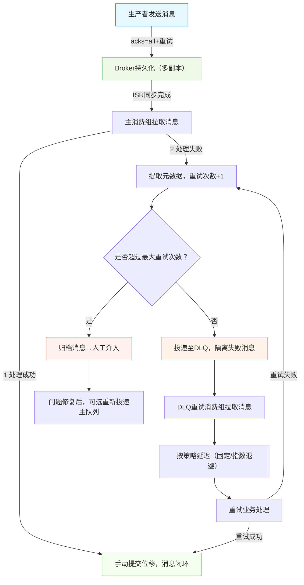

> （注：文档部分内容可能由 AI 生成）

# 一、概述

Kafka消息可靠性保障核心包含两大维度：一是“消息不丢失”，通过生产者端、服务端（Broker）、消费者端三端协同机制，确保消息从发送到处理全链路不丢失；二是“消费失败兜底”，通过死信队列（Dead Letter Queue, DLQ）重试机制，将消费失败消息隔离处理，避免无限循环和主队列阻塞，最终通过归档兜底确保消息可追溯与问题可排查。

本文档整合上述两大核心保障体系，适用于所有基于Kafka的消息驱动场景（如订单支付、日志处理、异步通知等），核心价值是平衡业务可靠性与系统稳定性，全面降低消息丢失和业务阻塞风险。

# 二、核心机制与设计原则

## 2.1 核心机制

Kafka消息可靠性保障通过“三端防丢失+DLQ重试兜底”的全流程闭环实现，关键依赖两大核心能力集群：

- **三端防丢失能力**：生产者确保消息成功投递、服务端确保消息持久化、消费者确保消息处理完成，从源头规避丢失风险；

- **DLQ重试兜底能力**：通过“失败隔离→元数据追踪→策略化重试→归档兜底”，处理偶发消费失败场景，形成最后一道可靠性屏障；

- **协同保障**：三端防丢失是基础，DLQ重试是补充，两者结合实现“不丢失、不阻塞、可追溯”的核心目标。

## 2.2 设计原则

|设计原则|具体要求|核心目的|
|---|---|---|
|隔离性|DLQ与主Topic独立、消费组独立、资源池独立；三端配置隔离（生产者重试/消费者位移等）|避免重试任务与主业务冲突，防丢失配置不影响核心流程性能|
|可追溯性|消息携带重试次数、失败原因等元数据；三端操作记录日志（投递/持久化/处理）|便于问题排查与全链路追踪|
|防无限循环|严格限制DLQ最大重试次数（推荐3-5次）；生产者重试设置上限|避免无效重试占用系统资源|
|幂等性保障|消费逻辑需实现幂等；生产者支持幂等配置；服务端避免重复持久化|防止重试/重投导致消息重复处理或重复存储|
|可靠性|DLQ与主Topic副本数≥3，手动提交位移；服务端持久化配置兜底；生产者确认机制生效|确保消息从发送到处理全链路不丢失|

# 三、消息不丢失保障机制（三端协同）

消息不丢失的核心是“三端协同兜底”，即生产者端确保消息成功投递、服务端确保消息持久化、消费者端确保消息处理完成，每一端均通过核心配置+机制实现可靠性保障。

## 3.1 生产者端：确保消息成功投递至Kafka

核心目标是避免消息在发送过程中丢失，通过确认机制、重试机制、异常处理三重保障，确保消息被Kafka正确接收并确认。

### 3.1.1 核心配置（必改）

|配置项|推荐值|作用说明|
|---|---|---|
|acks|all（或-1）|要求所有ISR副本写入成功才返回确认，最可靠的确认级别；避免单副本故障导致丢失|
|retries|3-5|网络抖动、Leader切换等临时故障时自动重试，避免偶发故障导致丢失|
|retry.backoff.ms|100-500|重试间隔，避免频繁重试加剧系统压力|
|enable.idempotence|true|开启幂等性，生产者给每条消息加唯一标识，避免重试导致重复发送|
|max.in.flight.requests.per.connection|1（顺序要求高）/5（性能优先）|单连接未完成请求上限，设为1可保证重试时消息顺序不乱|

### 3.1.2 核心机制与最佳实践

- **异步发送+回调确认**：优先使用异步发送提升性能，通过回调函数捕获发送结果，失败时记录日志并触发兜底逻辑；

- **本地缓存兜底**：关键消息发送前先写入本地文件/Redis，发送成功后删除，失败则定时重试（避免Kafka集群故障导致丢失）；

- **事务消息（进阶）**：跨Topic/分区发送时，开启生产者事务（配置transactional.id），确保消息原子性投递。

## 3.2 服务端（Broker）：确保消息持久化不丢失

核心目标是避免消息在存储过程中丢失，通过多副本、持久化、ISR机制三重保障，确保写入的消息稳定存储且可恢复。

### 3.2.1 核心配置（必改）

|配置项|推荐值|作用说明|
|---|---|---|
|replication.factor|≥3|每个分区副本数，确保单Broker节点故障时，消息可从其他副本恢复|
|min.insync.replicas|2（需<副本数）|最小同步副本数，ISR副本数低于此值时生产者报错，避免少数副本写入成功后丢失|
|log.flush.interval.ms|1000-5000|每1-5秒将内存数据刷盘，避免OS PageCache故障导致内存数据丢失|
|replica.lag.time.max.ms|30000|Follower同步超时阈值，超时则移出ISR，避免同步过慢影响可靠性|
|delete.topic.enable|false|禁止手动删除Topic，防止误操作导致消息丢失|

### 3.2.2 核心机制与最佳实践

- **ISR机制**：仅同步完成的副本（ISR列表）参与Leader选举，确保选举出的新Leader包含完整数据；

- **KRaft模式**：替代ZooKeeper管理元数据，元数据存储在内部Topic，避免元数据丢失导致集群不可用；

- **磁盘监控**：监控log.dirs目录磁盘使用率，使用率超过85%时触发告警并限制写入，避免磁盘满导致消息无法持久化。

## 3.3 消费者端：确保消息处理完成不丢失

核心目标是避免消息在处理过程中丢失，通过手动位移提交、异常处理、兜底机制三重保障，确保消息处理完成后再确认。

### 3.3.1 核心配置（必改）

|配置项|推荐值|作用说明|
|---|---|---|
|enable.auto.commit|false|关闭自动提交，改为手动提交位移，确保消息处理完成后再确认|
|max.poll.records|100-500|每次拉取消息数，避免一次拉取过多导致处理超时|
|max.poll.interval.ms|300000（5分钟）|消费间隔超时阈值，避免消费线程阻塞导致重平衡|
|auto.offset.reset|earliest|消费组首次启动或位移丢失时，从最早位置开始消费，避免消息遗漏|

### 3.3.2 核心机制与最佳实践

- **手动位移提交**：处理完一批消息后同步提交位移（commitSync），失败则不提交，确保消息至少处理一次；

- **死信队列兜底**：处理失败的消息投递至DLQ，避免阻塞正常消费（后续章节详细说明）；

- **幂等处理**：消费逻辑实现幂等性（基于业务唯一ID/分布式锁/乐观锁），避免重复消费影响业务；

- **消费位移监控**：监控消费lag值（消费位移与分区末尾位移差），及时发现消费停滞。

# 四、完整流程总览（防丢失+DLQ重试）

Kafka消息可靠性保障全流程，是“三端防丢失+DLQ重试兜底”的协同闭环，流程如下（含流程图）：



## 4.1 流程分步说明

1. **生产投递**：生产者开启acks=all和重试机制，确保消息成功投递至Broker并完成多副本同步；

2. **服务端持久化**：Broker将消息写入磁盘，通过ISR机制确保副本同步，避免节点故障导致丢失；

3. **主队列消费**：主消费组拉取消息，关闭自动提交，处理成功后手动提交位移；

4. **失败隔离与重试**：消费失败则提取元数据，未超最大重试次数则投递至DLQ，由独立消费组按策略重试；

5. **兜底归档**：超过最大重试次数的消息归档，人工修复后可重新投递，确保消息可追溯。

# 五、关键组件与配置规范

## 5.1 核心组件定义

|组件名称|核心作用|配置规范|
|---|---|---|
|主业务Topic|存储正常业务消息，供主消费组消费|副本数≥3，分区数按业务并发规划，关闭自动删除（delete.topic.enable=false）|
|DLQ Topic|隔离存储消费失败消息，供重试消费组处理|命名规则：{主Topic名}.dlq；副本数=主Topic；分区数=主Topic；保留时间≥7天（log.retention.hours=168）|
|主消费组|消费主Topic消息，执行核心业务逻辑|关闭自动提交（enable.auto.commit=false）；配置合理拉取参数（max.poll.records=500）|
|DLQ重试消费组|消费DLQ消息，执行重试逻辑|独立命名（{主消费组名}.dlq-retry）；与主消费组资源隔离；手动提交位移|
|归档存储|存储超过最大重试次数的失败消息|推荐MySQL/对象存储（如S3）；记录消息完整信息+元数据+失败原因|
|Broker集群|消息持久化与转发，保障多副本同步|副本数≥3，开启KRaft模式，配置合理刷盘与ISR参数|

## 5.2 核心配置参数（汇总版）

### 5.2.1 生产者配置（防丢失+DLQ投递）

```properties

# 可靠性配置（必选）
acks=all  # 所有ISR副本写入成功才确认
retries=3  # 投递失败自动重试3次
retry.backoff.ms=100  # 重试间隔100ms
enable.idempotence=true  # 开启幂等性，避免重复发送
max.in.flight.requests.per.connection=1  # 保证重试顺序（顺序要求高场景）

# 序列化配置（必选）
key.serializer=org.apache.kafka.common.serialization.StringSerializer
value.serializer=org.apache.kafka.common.serialization.StringSerializer
```

### 5.2.2 服务端（Broker）配置（防丢失）

```properties

# 副本与同步配置（必选）
replication.factor=3  # 分区副本数3个
min.insync.replicas=2  # 最小同步副本数2个
replica.lag.time.max.ms=30000  # Follower同步超时30s

# 持久化配置（必选）
log.flush.interval.ms=1000  # 每1秒刷盘一次
log.retention.hours=168  # 日志保留7天

# 安全配置（推荐）
delete.topic.enable=false  # 禁止手动删除Topic
auto.create.topics.enable=false  # 禁止自动创建Topic
```

### 5.2.3 消费者配置（防丢失+DLQ重试）

```properties

# 核心可靠性配置（必选）
enable.auto.commit=false  # 关闭自动提交位移
auto.offset.reset=earliest  # 位移丢失时从最早位置消费
offset.commit.timeout.ms=5000  # 位移提交超时5s

# 消费控制配置（推荐）
max.poll.records=500  # 每次拉取500条消息
max.poll.interval.ms=300000  # 消费间隔超时5分钟

# 序列化配置（必选）
key.deserializer=org.apache.kafka.common.serialization.StringDeserializer
value.deserializer=org.apache.kafka.common.serialization.StringDeserializer
```

## 5.3 消息元数据规范（Headers携带）

投递至DLQ的消息必须携带以下元数据，支撑重试策略与问题追溯，同时适配三端防丢失排查需求：

|Headers键|数据类型|取值说明|核心作用|
|---|---|---|---|
|retry_count|int|初始0，每次重试累加1|控制最大重试次数，避免无限循环|
|failure_reason|string|异常类名+异常信息（如NullPointerException: xxx）|快速定位消费失败原因|
|origin_topic|string|原消息所属的主业务Topic名称|追溯消息来源，重试成功后回写业务流程|
|first_failure_time|long|首次消费失败的时间戳（毫秒）|计算重试延迟，评估失败持续时长|
|business_id|string|业务唯一标识（如订单号、流水号）|支撑消费幂等性处理，避免重复业务操作|

# 六、核心实现要点

## 6.1 重试策略选型

根据业务场景选择合适的重试策略，平衡重试效率与系统压力，适配三端防丢失后的兜底需求：

|重试策略|适用场景|实现方式|示例|
|---|---|---|---|
|固定延迟重试|下游服务需要固定时间恢复（如定时运维）|每次重试间隔固定|间隔5分钟，重试3次|
|指数退避重试|网络抖动、下游服务限流（高频偶发失败）|重试间隔按指数增长|1s→2s→4s→8s（基数1000ms）|
|人工介入重试|消息本身错误（如数据格式非法、业务逻辑冲突）|超过最大重试次数后归档，人工修复后重新投递|重试5次失败→归档→人工修复数据→重新投递主Topic|

## 6.2 幂等性实现要点

重试与重投必然导致消息重复，需在三端协同实现幂等性，推荐3种常用方案：

- **基于业务唯一ID去重**：消息携带唯一业务ID（如订单号、流水号），生产者避免重复发送，消费者处理前查询数据库是否已处理；

- **分布式锁控制**：消费者处理消息时，通过Redis SETNX/Redlock获取锁，同一时间仅允许一个线程处理该消息；

- **数据库乐观锁**：消费者更新业务数据时，添加版本号条件（如WHERE id=? AND version=?），版本不匹配则说明已处理，直接返回成功。

# 七、最佳实践

## 7.1 监控与告警（全链路覆盖）

核心监控指标与告警策略，覆盖三端防丢失与DLQ重试全流程，确保异常及时发现：

- 生产者监控：发送成功率（需100%）、重试次数（异常递增时告警）、本地缓存堆积量（非空时告警）；

- 服务端监控：Broker节点存活状态、副本同步状态（ISR列表变化告警）、磁盘使用率（>85%告警）、消息持久化成功率；

- 消费者监控：消费lag值（DLQ与主队列均需监控，lag>1000告警）、消费成功率（需100%）、位移提交成功率；

- DLQ重试监控：重试次数分布（≥最大阈值80%告警）、失败原因统计（某类失败占比>50%告警）、归档消息数（每日递增>100条告警）。

## 7.2 系统稳定性保障

- 资源隔离：DLQ重试消费组与主消费组线程池、内存资源独立；Broker节点独立部署，避免资源竞争；

- 限流熔断：生产者对发送频率限流，消费者对下游服务限流（令牌桶算法）；下游服务持续失败时触发熔断，暂停重试减少无效请求；

- 数据清理：定期清理归档后的DLQ消息（保留7天）、Broker过期日志，避免磁盘空间溢出；

- 灾备预案：Broker集群部署多可用区，生产者本地缓存支持持久化，归档消息定期备份，确保极端场景下数据可恢复。

# 八、总结

Kafka消息可靠性保障的核心，是“三端防丢失+DLQ重试兜底”的协同闭环体系，两者相辅相成：

1. **三端防丢失是基础**：生产者通过确认+重试确保投递成功，服务端通过多副本+持久化确保存储安全，消费者通过手动提交+异常处理确保处理完成，从源头规避消息丢失风险；

2. **DLQ重试是兜底**：针对偶发消费失败场景，通过隔离失败消息、策略化重试、归档兜底，避免主队列阻塞，确保消息可追溯与问题可排查；

3. **核心保障要点**：全流程幂等性实现、精细化配置（三端配置协同）、全链路监控告警、资源隔离与灾备预案；

4. **落地价值**：本体系可直接应用于生产环境，适配各类Kafka消息消费场景，通过标准化配置与实现，全面降低消息丢失和业务阻塞风险，提升系统整体可靠性。

