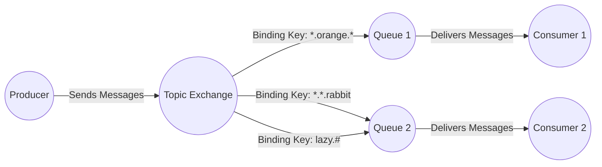

# RabbitMQ教程 - 主题（使用Java客户端）
在上一个教程中，我们改进了日志系统。不再仅使用只能进行简单广播的`fanout`（扇出）交换器，而是使用了`direct`（直连）交换器，从而能够有选择地接收日志。

虽然使用直连交换器改进了我们的系统，但它仍然存在局限性——无法基于多个条件进行路由。

在我们的日志系统中，可能不仅希望根据严重程度订阅日志，还希望根据发出日志的源进行订阅。你可能从Unix系统的`syslog`工具中了解过这个概念，它会根据严重程度（信息/警告/严重错误等）和设备（认证/定时任务/内核等）对日志进行路由。

这将为我们带来极大的灵活性——我们可能既想监听来自“定时任务”的严重错误，又想获取“内核”发出的所有日志。

为了在日志系统中实现这一点，我们需要学习更复杂的`topic`（主题）交换器。
## 主题交换器
发送到主题交换器的消息不能有任意的`routing_key`（路由键），它必须是由点分隔的单词列表。这些单词可以是任何内容，但通常会指定与消息相关的一些特征。一些有效的路由键示例：`stock.usd.nyse`、`nyse.vmw`、`quick.orange.rabbit`。路由键中的单词数量没有限制，最多可达255字节。

绑定键也必须采用相同的形式。主题交换器背后的逻辑与直连交换器类似——使用特定路由键发送的消息将被发送到所有使用匹配绑定键绑定的队列。不过，绑定键有两个重要的特殊情况：
- `*`（星号）可以精确替换一个单词。
- `#`（井号）可以替换零个或多个单词。

通过示例来解释最容易理解：

在这个示例中，我们将发送所有描述动物的消息。消息将使用由三个单词（两个点）组成的路由键进行发送。路由键的第一个单词描述速度，第二个描述颜色，第三个描述物种：`<speed>.<colour>.<species>`。

我们创建了三个绑定：Q1使用绑定键`*.orange.*`进行绑定，Q2使用`*.*.rabbit`和`lazy.#`进行绑定。

这些绑定可以总结如下：
- Q1对所有橙色的动物感兴趣。
- Q2想获取关于兔子的所有消息，以及关于慵懒动物的所有消息。

路由键设置为`quick.orange.rabbit`的消息将被发送到两个队列。`lazy.orange.elephant`消息也将发送到这两个队列。另一方面，`quick.orange.fox`只会发送到第一个队列，`lazy.brown.fox`只会发送到第二个队列。`lazy.pink.rabbit`只会被发送到第二个队列一次，即使它匹配了两个绑定。`quick.brown.fox`不匹配任何绑定，因此将被丢弃。

如果我们违反约定，发送只有一个单词或四个单词的消息，比如`orange`或`quick.orange.new.rabbit`会怎样呢？这些消息将不匹配任何绑定，并且会丢失。

另一方面，`lazy.orange.new.rabbit`虽然有四个单词，但它将匹配最后一个绑定，并被发送到第二个队列。
### 主题交换器
主题交换器功能强大，可以表现得像其他交换器：
- 当一个队列使用`#`（井号）绑定键绑定时，它将接收所有消息，而不管路由键是什么，这和`fanout`（扇出）交换器的行为一样。
- 当绑定中不使用特殊字符`*`（星号）和`#`（井号）时，主题交换器的行为就和`direct`（直连）交换器一样。
## 整合
我们将在日志系统中使用主题交换器。我们先假设日志的路由键有两个单词：`<facility>.<severity>`（设备.严重程度）。

代码与上一个教程几乎相同。

`EmitLogTopic.java`的代码：
```java
import com.rabbitmq.client.Channel;
import com.rabbitmq.client.Connection;
import com.rabbitmq.client.ConnectionFactory;

public class EmitLogTopic {
    private static final String EXCHANGE_NAME = "topic_logs";

    public static void main(String[] argv) throws Exception {
        ConnectionFactory factory = new ConnectionFactory();
        factory.setHost("localhost");
        try (Connection connection = factory.newConnection();
             Channel channel = connection.createChannel()) {
            channel.exchangeDeclare(EXCHANGE_NAME, "topic");
            String routingKey = getRouting(argv);
            String message = getMessage(argv);
            channel.basicPublish(EXCHANGE_NAME, routingKey, null, message.getBytes("UTF-8"));
            System.out.println(" [x] Sent '" + routingKey + "':'" + message + "'");
        }
    }
    // 其他方法...
}
```
`ReceiveLogsTopic.java`的代码：
```java
import com.rabbitmq.client.Channel;
import com.rabbitmq.client.Connection;
import com.rabbitmq.client.ConnectionFactory;
import com.rabbitmq.client.DeliverCallback;

public class ReceiveLogsTopic {
    private static final String EXCHANGE_NAME = "topic_logs";

    public static void main(String[] argv) throws Exception {
        ConnectionFactory factory = new ConnectionFactory();
        factory.setHost("localhost");
        Connection connection = factory.newConnection();
        Channel channel = connection.createChannel();
        channel.exchangeDeclare(EXCHANGE_NAME, "topic");
        String queueName = channel.queueDeclare().getQueue();
        if (argv.length < 1) {
            System.err.println("Usage: ReceiveLogsTopic [binding_key]...");
            System.exit(1);
        }
        for (String bindingKey : argv) {
            channel.queueBind(queueName, EXCHANGE_NAME, bindingKey);
        }
        System.out.println(" [*] Waiting for messages. To exit press CTRL+C");
        DeliverCallback deliverCallback = (consumerTag, delivery) -> {
            String message = new String(delivery.getBody(), "UTF-8");
            System.out.println(" [x] Received '" +
                    delivery.getEnvelope().getRoutingKey() + "':'" + message + "'");
        };
        channel.basicConsume(queueName, true, deliverCallback, consumerTag -> { });
    }
}
```
按照教程1中的方法编译并运行示例，包括设置类路径，在Windows系统上使用`%CP%`。
- **编译**：
```bash
javac -cp $CP ReceiveLogsTopic.java EmitLogTopic.java
```
- **接收所有日志**：
```bash
java -cp $CP ReceiveLogsTopic "#"
```
- **接收来自`kern`设备的所有日志**：
```bash
java -cp $CP ReceiveLogsTopic "kern.*"
```
- **如果你只想接收`critical`（严重）日志**：
```bash
java -cp $CP ReceiveLogsTopic "*.critical"
```
- **你可以创建多个绑定**：
```bash
java -cp $CP ReceiveLogsTopic "kern.*" "*.critical"
```
- **要发送一个路由键为`kern.critical`的日志，输入**：
```bash
java -cp $CP EmitLogTopic "kern.critical" "A critical kernel error"
```
尽情体验这些程序吧。注意，代码并没有对路由键或绑定键做任何假设，你可以尝试使用超过两个路由键参数。

接下来，在教程6中了解如何像远程过程调用一样进行消息往返。 