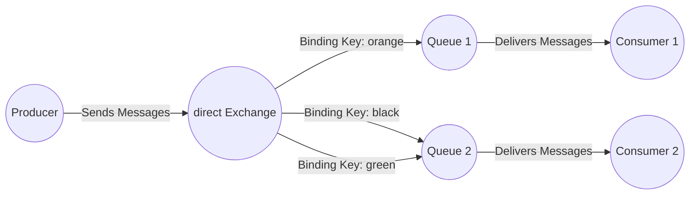
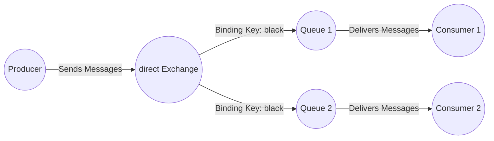
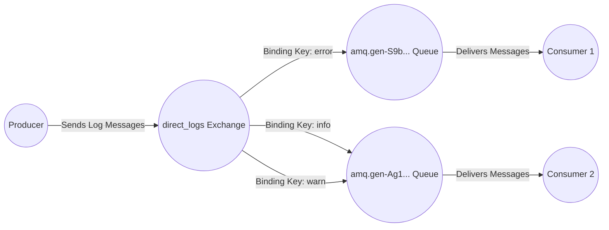

# RabbitMQ教程 - 路由（使用Java客户端）
在上一个教程中，我们构建了一个简单的日志系统，能够将日志消息广播给多个接收者。

在本教程中，我们将为其添加一个新特性——让接收者可以只订阅部分消息。例如，我们可以将关键错误消息定向到日志文件（以节省磁盘空间），同时仍然能够在控制台上打印所有日志消息。
## 绑定
在之前的示例中，我们已经创建过绑定。你可能还记得类似这样的代码：
```java
channel.queueBind(queueName, EXCHANGE_NAME, "");
```
绑定是交换器和队列之间的一种关系。可以简单理解为：该队列对来自这个交换器的消息感兴趣 。

绑定可以有一个额外的`routingKey`参数。为了避免与`basic_publish`的参数混淆，我们将其称为`binding key`（绑定键）。以下是如何使用绑定键创建绑定：
```java
channel.queueBind(queueName, EXCHANGE_NAME, "black");
```
绑定键的含义取决于交换器的类型。我们之前使用的`fanout`（扇出）交换器会直接忽略绑定键的值。
## 直连交换器
上一教程中的日志系统会将所有消息广播给所有消费者。我们希望扩展这个功能，使其能够根据消息的严重程度进行过滤。例如，我们可能希望一个将日志消息写入磁盘的程序只接收关键错误消息，而不会在警告或信息日志消息上浪费磁盘空间。

我们之前使用的`fanout`交换器灵活性不足，它只能进行盲目广播。

我们将改用`direct`（直连）交换器。直连交换器背后的路由算法很简单——消息会被发送到绑定键与消息的路由键完全匹配的队列中。

为了说明这一点，请看下面的设置：

在这个设置中，我们可以看到直连交换器`X`有两个队列与之绑定。第一个队列的绑定键是`orange`，第二个队列有两个绑定，绑定键分别是`black`和`green`。

在这样的设置下，发布到交换器且路由键为`orange`的消息将被路由到队列`Q1`。路由键为`black`或`green`的消息将被发送到`Q2`。其他所有消息都将被丢弃。
## 多个绑定

使用相同的绑定键绑定多个队列是完全可行的。在我们的示例中，可以在`X`和`Q1`之间添加一个绑定键为`black`的绑定。在这种情况下，直连交换器的行为会类似于`fanout`交换器，它会将消息广播到所有匹配的队列。路由键为`black`的消息将被发送到`Q1`和`Q2`。
## 发送日志
我们将在日志系统中使用这种模型。不再使用`fanout`交换器，而是将消息发送到`direct`交换器，并将日志的严重程度作为`routing key`（路由键）。这样，接收程序就可以选择它想要接收的严重程度的消息。我们先聚焦于发送日志的部分。

一如既往，我们首先需要创建一个交换器：
```java
channel.exchangeDeclare(EXCHANGE_NAME, "direct");
```
然后就可以发送消息了：
```java
channel.basicPublish(EXCHANGE_NAME, severity, null, message.getBytes());
```
为了简化，我们假设`severity`（严重程度）可以是`info`（信息）、`warning`（警告）或`error`（错误）中的一种。
## 订阅
接收消息的方式与上一教程基本相同，只有一个例外——我们要为感兴趣的每种严重程度创建一个新的绑定。
```java
String queueName = channel.queueDeclare().getQueue();
for(String severity : argv){
    channel.queueBind(queueName, EXCHANGE_NAME, severity);
}
```
## 整合

`EmitLogDirect.java`类的代码：
```java
import com.rabbitmq.client.Channel;
import com.rabbitmq.client.Connection;
import com.rabbitmq.client.ConnectionFactory;

public class EmitLogDirect {
    private static final String EXCHANGE_NAME = "direct_logs";

    public static void main(String[] argv) throws Exception {
        ConnectionFactory factory = new ConnectionFactory();
        factory.setHost("localhost");
        try (Connection connection = factory.newConnection();
             Channel channel = connection.createChannel()) {
            channel.exchangeDeclare(EXCHANGE_NAME, "direct");
            String severity = getSeverity(argv);
            String message = getMessage(argv);
            channel.basicPublish(EXCHANGE_NAME, severity, null, message.getBytes("UTF-8"));
            System.out.println(" [x] Sent '" + severity + "':'" + message + "'");
        }
    }
    // 其他方法...
}
```
`ReceiveLogsDirect.java`的代码：
```java
import com.rabbitmq.client.*;

public class ReceiveLogsDirect {
    private static final String EXCHANGE_NAME = "direct_logs";

    public static void main(String[] argv) throws Exception {
        ConnectionFactory factory = new ConnectionFactory();
        factory.setHost("localhost");
        Connection connection = factory.newConnection();
        Channel channel = connection.createChannel();
        channel.exchangeDeclare(EXCHANGE_NAME, "direct");
        String queueName = channel.queueDeclare().getQueue();
        if (argv.length < 1) {
            System.err.println("Usage: ReceiveLogsDirect [info] [warning] [error]");
            System.exit(1);
        }
        for (String severity : argv) {
            channel.queueBind(queueName, EXCHANGE_NAME, severity);
        }
        System.out.println(" [*] Waiting for messages. To exit press CTRL+C");
        DeliverCallback deliverCallback = (consumerTag, delivery) -> {
            String message = new String(delivery.getBody(), "UTF-8");
            System.out.println(" [x] Received '" +
                    delivery.getEnvelope().getRoutingKey() + "':'" + message + "'");
        };
        channel.basicConsume(queueName, true, deliverCallback, consumerTag -> { });
    }
}
```
像往常一样进行编译（关于编译和类路径的建议，请参考教程一）。为了方便，运行示例时我们将使用环境变量`$CP`（在Windows上是`%CP%`）来设置类路径。
```bash
javac -cp $CP ReceiveLogsDirect.java EmitLogDirect.java
```
如果你只想将`warning`（警告）和`error`（错误）（而不是`info`（信息））日志消息保存到文件中，只需打开一个控制台并输入：
```bash
java -cp $CP ReceiveLogsDirect warning error > logs_from_rabbit.log
```
如果你想在屏幕上查看所有日志消息，打开一个新的终端并输入：
```bash
java -cp $CP ReceiveLogsDirect info warning error
# => [*] Waiting for logs. To exit press CTRL+C
```
例如，要发送一条`error`（错误）日志消息，只需输入：
```bash
java -cp $CP EmitLogDirect error "Run. Run. Or it will explode."
# => [x] Sent 'error':'Run. Run. Or it will explode.'
```
（[EmitLogDirect.java源代码](https://www.rabbitmq.com/tutorials/tutorial-four-java#EmitLogDirect.java source)和[ReceiveLogsDirect.java源代码](https://www.rabbitmq.com/tutorials/tutorial-four-java#ReceiveLogsDirect.java source)的完整代码）

请继续学习教程5，了解如何基于模式监听消息。 