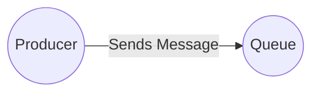
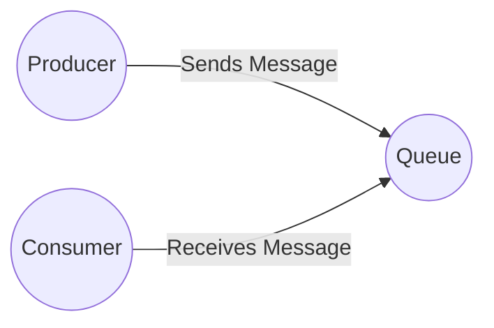
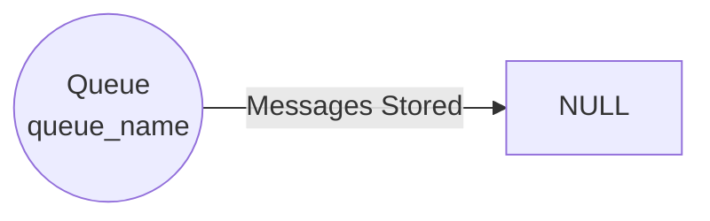
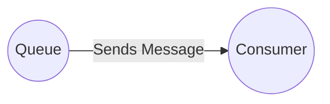
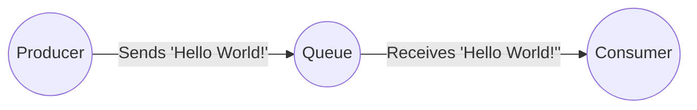

# RabbitMQ教程 - “Hello World!”
## 简介

RabbitMQ是一个消息代理：它接收并转发消息。你可以把它想象成一个邮局：当你把想要邮寄的信件放入邮箱时，你可以确定邮递员最终会把信件送到收件人手中。在这个类比中，RabbitMQ就相当于邮箱、邮局和邮递员。

RabbitMQ与邮局的主要区别在于，它处理的不是纸张，而是接收、存储和转发数据二进制块——即消息。

RabbitMQ以及一般的消息传递都使用一些术语。
- **生产（Producing）** 仅仅意味着发送。发送消息的程序就是**生产者（producer）**：

- **队列（Queue）** 是RabbitMQ中邮箱的代名词。虽然消息在RabbitMQ和你的应用程序之间流动，但它们只能存储在队列中。队列仅受主机内存和磁盘限制的约束，本质上它是一个大型消息缓冲区。许多生产者可以向一个队列发送消息，许多消费者也可以尝试从一个队列接收数据。

我们用如下方式表示队列：

- **消费（Consuming）** 与接收的含义类似。**消费者（consumer）** 是一个主要等待接收消息的程序：

请注意，生产者、消费者和代理不必位于同一主机上；实际上，在大多数应用程序中它们也确实不在同一主机上。一个应用程序也可以既是生产者又是消费者。
## “Hello World”（使用Java客户端）
在本教程的这一部分，我们将用Java编写两个程序；一个生产者发送一条简单消息，一个消费者接收消息并将其打印出来。我们将略过Java API中的一些细节，专注于这个非常简单的示例来入门。这是消息传递领域的 “Hello World” 程序。

在下面的图表中，“P” 是我们的生产者，“C” 是我们的消费者。中间的框是一个队列——RabbitMQ为消费者维护的消息缓冲区。

### Java客户端库
RabbitMQ支持多种协议。本教程使用AMQP 0 - 9 - 1，这是一种开放的、通用的消息传递协议。RabbitMQ有许多不同语言的客户端。我们将使用RabbitMQ提供的Java客户端。

下载客户端库及其依赖项（SLF4J API和SLF4J Simple）。将这些文件与教程中的Java文件一起复制到你的工作目录中。

请注意，SLF4J Simple对于教程来说已经足够，但在生产环境中你应该使用像Logback这样功能完备的日志库。

（RabbitMQ Java客户端也在中央Maven仓库中，groupId为`com.rabbitmq`，artifactId为`amqp-client`。）

现在我们有了Java客户端及其依赖项，就可以编写代码了。
### 发送消息
我们将消息发布者（发送者）命名为`Send`，消息消费者（接收者）命名为`Recv`。发布者将连接到RabbitMQ，发送一条消息，然后退出。

在`Send.java`中，我们需要导入一些类：
```java
import com.rabbitmq.client.ConnectionFactory;
import com.rabbitmq.client.Connection;
import com.rabbitmq.client.Channel;
```
设置类并命名队列：
```java
public class Send {
    private final static String QUEUE_NAME = "hello";
    public static void main(String[] argv) throws Exception {
        // 后续代码在此处
    }
}
```
然后我们可以创建到服务器的连接：
```java
ConnectionFactory factory = new ConnectionFactory();
factory.setHost("localhost");
try (Connection connection = factory.newConnection();
     Channel channel = connection.createChannel()) {
}
```
连接抽象了套接字连接，并为我们处理协议版本协商和身份验证等事宜。这里我们连接到本地机器上的RabbitMQ节点——因此使用`localhost`。如果我们想连接到不同机器上的节点，只需在此处指定其主机名或IP地址即可。

接下来，我们创建一个通道，大多数用于完成操作的API都位于这个通道中。注意，我们可以使用`try-with-resources`语句，因为`Connection`和`Channel`都实现了`java.lang.AutoCloseable`接口。这样我们就无需在代码中显式关闭它们。

为了发送消息，我们必须声明一个要发送到的队列；然后我们可以向该队列发布消息，所有这些操作都在`try-with-resources`语句中：
```java
channel.queueDeclare(QUEUE_NAME, false, false, false, null);
String message = "Hello World!";
channel.basicPublish("", QUEUE_NAME, null, message.getBytes());
System.out.println(" [x] Sent '" + message + "'");
```
声明队列是幂等操作——只有在队列不存在时才会创建它。消息内容是一个字节数组，所以你可以在其中编码任何你想要的内容。

以下是完整的`Send.java`类：
```java
import com.rabbitmq.client.ConnectionFactory;
import com.rabbitmq.client.Connection;
import com.rabbitmq.client.Channel;

public class Send {
    private final static String QUEUE_NAME = "hello";

    public static void main(String[] argv) throws Exception {
        ConnectionFactory factory = new ConnectionFactory();
        factory.setHost("localhost");
        try (Connection connection = factory.newConnection();
             Channel channel = connection.createChannel()) {
            channel.queueDeclare(QUEUE_NAME, false, false, false, null);
            String message = "Hello World!";
            channel.basicPublish("", QUEUE_NAME, null, message.getBytes());
            System.out.println(" [x] Sent '" + message + "'");
        }
    }
}
```
#### 发送失败！
如果你是第一次使用RabbitMQ，却没有看到 “Sent” 消息，你可能会困惑地挠头，想知道哪里出了问题。也许是因为代理启动时可用磁盘空间不足（默认情况下至少需要50MB可用空间），因此拒绝接受消息。查看代理日志文件，看看是否记录了资源警报，如有必要，降低可用磁盘空间阈值。配置指南将向你展示如何设置`disk_free_limit`。
### 接收消息
这就是我们的发布者的全部内容。我们的消费者监听来自RabbitMQ的消息，与发布者只发送一条消息不同，我们将让消费者保持运行，监听消息并打印出来。

`Recv.java`中的代码与`Send.java`有几乎相同的导入：
```java
import com.rabbitmq.client.Channel;
import com.rabbitmq.client.Connection;
import com.rabbitmq.client.ConnectionFactory;
import com.rabbitmq.client.DeliverCallback;
```
额外导入的`DeliverCallback`接口将用于缓冲服务器推送给我们的消息。

设置部分与发布者相同；我们打开一个连接和一个通道，并声明要从中消费消息的队列。注意，这个队列要与`send`发布消息的队列相匹配。
```java
public class Recv {
    private final static String QUEUE_NAME = "hello";
    public static void main(String[] argv) throws Exception {
        ConnectionFactory factory = new ConnectionFactory();
        factory.setHost("localhost");
        Connection connection = factory.newConnection();
        Channel channel = connection.createChannel();
        channel.queueDeclare(QUEUE_NAME, false, false, false, null);
        System.out.println(" [*] Waiting for messages. To exit press CTRL+C");
    }
}
```
注意，我们在这里也声明了队列。因为我们可能会在发布者之前启动消费者，所以我们要确保在尝试从队列消费消息之前队列已经存在。

为什么我们不使用`try-with-resource`语句来自动关闭通道和连接呢？因为这样做会使程序继续执行，关闭所有内容并退出！这会很麻烦，因为我们希望在消费者异步监听消息到达时，进程保持运行状态。

我们即将告诉服务器从队列中向我们交付消息。由于服务器会异步地向我们推送消息，所以我们以对象的形式提供一个回调，该回调将缓冲消息，直到我们准备好使用它们。这就是`DeliverCallback`子类的作用。
```java
DeliverCallback deliverCallback = (consumerTag, delivery) -> {
    String message = new String(delivery.getBody(), "UTF-8");
    System.out.println(" [x] Received '" + message + "'");
};
channel.basicConsume(QUEUE_NAME, true, deliverCallback, consumerTag -> { });
```
以下是完整的`Recv.java`类：
```java
import com.rabbitmq.client.Channel;
import com.rabbitmq.client.Connection;
import com.rabbitmq.client.ConnectionFactory;
import com.rabbitmq.client.DeliverCallback;

public class Recv {
    private final static String QUEUE_NAME = "hello";

    public static void main(String[] argv) throws Exception {
        ConnectionFactory factory = new ConnectionFactory();
        factory.setHost("localhost");
        Connection connection = factory.newConnection();
        Channel channel = connection.createChannel();
        channel.queueDeclare(QUEUE_NAME, false, false, false, null);
        System.out.println(" [*] Waiting for messages. To exit press CTRL+C");

        DeliverCallback deliverCallback = (consumerTag, delivery) -> {
            String message = new String(delivery.getBody(), "UTF-8");
            System.out.println(" [x] Received '" + message + "'");
        };
        channel.basicConsume(QUEUE_NAME, true, deliverCallback, consumerTag -> { });
    }
}
```
### 整合
你只需在类路径中包含RabbitMQ Java客户端，就可以编译这两个文件：
```bash
javac -cp amqp-client-5.16.0.jar Send.java Recv.java
```
要运行它们，你需要在类路径中包含`rabbitmq-client.jar`及其依赖项。在终端中，先运行消费者（接收者）：
```bash
java -cp .:amqp-client-5.16.0.jar:slf4j-api-1.7.36.jar:slf4j-simple-1.7.36.jar Recv
```
然后，运行发布者（发送者）：
```bash
java -cp .:amqp-client-5.16.0.jar:slf4j-api-1.7.36.jar:slf4j-simple-1.7.36.jar Send
```
在Windows系统上，使用分号而不是冒号来分隔类路径中的项。

消费者将打印它通过RabbitMQ从发布者那里收到的消息。消费者会一直运行，等待消息（使用Ctrl + C停止它），所以你可以尝试在另一个终端中运行发布者。
### 列出队列
你可能希望查看RabbitMQ中有哪些队列，以及每个队列中有多少条消息。你可以（以特权用户身份）使用`rabbitmqctl`工具来实现：
```bash
sudo rabbitmqctl list_queues
```
在Windows上，省略`sudo`：
```bash
rabbitmqctl.bat list_queues
```
现在是时候进入第2部分，构建一个简单的工作队列了。
### 提示
为了减少输入量，你可以为类路径设置一个环境变量，例如：
```bash
export CP=.:amqp-client-5.16.0.jar:slf4j-api-1.7.36.jar:slf4j-simple-1.7.36.jar
java -cp $CP Send
```
在Windows上：
```batch
set CP=.;amqp-client-5.16.0.jar;slf4j-api-1.7.36.jar;slf4j-simple-1.7.36.jar
java -cp %CP% Send
```