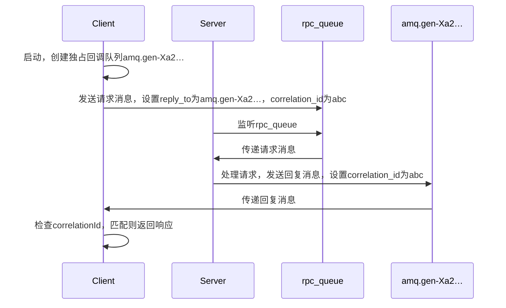

# RabbitMQ教程 - 远程过程调用（RPC）
## 远程过程调用（使用Java客户端）
在第二个教程中，我们学习了如何使用工作队列在多个工作进程之间分配耗时任务。

但是，如果我们需要在远程计算机上运行一个函数并等待结果呢？这就完全是另一回事了。这种模式通常被称为远程过程调用（Remote Procedure Call，简称RPC）。

在本教程中，我们将使用RabbitMQ构建一个RPC系统，包括一个客户端和一个可扩展的RPC服务器。由于我们没有任何值得分配的耗时任务，所以将创建一个虚拟的RPC服务，该服务返回斐波那契数列中的数字。
### 客户端接口
为了说明如何使用RPC服务，我们将创建一个简单的客户端类。它将公开一个名为`call`的方法，该方法发送RPC请求并阻塞，直到收到响应：
```java
FibonacciRpcClient fibonacciRpc = new FibonacciRpcClient();
String result = fibonacciRpc.call("4");
System.out.println( "fib(4) is " + result);
```
### 关于RPC的说明
虽然RPC在计算领域是一种相当常见的模式，但它也经常受到批评。当程序员不清楚一个函数调用是本地调用还是缓慢的RPC调用时，问题就出现了。这种混淆会导致系统不可预测，并增加调试的复杂性。如果使用不当，RPC非但不能简化软件，反而可能导致难以维护的混乱代码。

考虑到这些，请注意以下建议：
- 确保能明显区分本地函数调用和远程函数调用。
- 记录你的系统，明确组件之间的依赖关系。
- 处理错误情况。当RPC服务器长时间宕机时，客户端应如何响应？
- 如有疑问，避免使用RPC。如果可以，你应该使用异步管道，即结果会被异步推送到下一个计算阶段，而不是像RPC那样阻塞等待。
### 回调队列
一般来说，通过RabbitMQ实现RPC很简单。客户端发送请求消息，服务器用响应消息进行回复。为了接收响应，我们需要在请求中发送一个“回调”队列地址。我们可以使用默认队列（在Java客户端中是独占队列）。让我们试试看：
```java
callbackQueueName = channel.queueDeclare().getQueue();
BasicProperties props = new BasicProperties
      .Builder()
      .replyTo(callbackQueueName)
      .build();
channel.basicPublish("", "rpc_queue", props, message.getBytes());
// ... 然后是从回调队列读取响应消息的代码 ...
```
我们需要导入这个新类：
```java
import com.rabbitmq.client.AMQP.BasicProperties;
```
### 消息属性
AMQP 0 - 9 - 1协议预定义了一组与消息相关的14个属性。除了以下属性外，大多数属性很少使用：
- `deliveryMode`：将消息标记为持久化（值为`2`）或瞬态（任何其他值）。你可能在第二个教程中见过这个属性。
- `contentType`：用于描述编码的MIME类型。例如，对于常用的JSON编码，将此属性设置为`application/json`是个好习惯。
- `replyTo`：通常用于指定回调队列的名称。
- `correlationId`：用于将RPC响应与请求关联起来，非常有用。
### 关联ID
为每个RPC请求创建一个回调队列效率不高。更好的方法是为每个客户端创建一个单独的回调队列。

这就引出了一个新问题，当在该队列中收到响应时，不清楚该响应属于哪个请求。这时就需要使用`correlationId`属性。我们将为每个请求设置一个唯一的值。之后，当我们在回调队列中收到消息时，会查看这个属性，根据它来匹配响应和请求。如果看到未知的`correlationId`值，我们可以安全地丢弃该消息，因为它不属于我们的请求。

你可能会问，为什么我们要忽略回调队列中的未知消息，而不是报错呢？这是因为服务器端可能存在竞态条件。虽然不太可能，但RPC服务器有可能在向我们发送答案后，但在发送请求的确认消息之前崩溃。如果发生这种情况，重启后的RPC服务器将再次处理该请求。这就是为什么在客户端我们必须优雅地处理重复的响应，并且RPC理想情况下应该是幂等的。
### 总结

我们的RPC将按以下方式工作：
1. 客户端启动时，创建一个独占的回调队列。
2. 对于RPC请求，客户端发送一条包含两个属性的消息：`reply_to`（设置为回调队列）和`correlation_id`（为每个请求设置一个唯一值）。
3. 请求被发送到`rpc_queue`队列。
4. RPC工作进程（即服务器）在该队列上等待请求。当请求出现时，它执行任务，并使用`replyTo`字段中的队列将结果消息发送回客户端。
5. 客户端在回复队列上等待数据。当消息出现时，它检查`correlationId`属性。如果与请求中的值匹配，则将响应返回给应用程序。
### 整合
斐波那契任务：
```java
private static int fib(int n) {
    if (n == 0) return 0;
    if (n == 1) return 1;
    return fib(n - 1) + fib(n - 2);
}
```
我们声明了斐波那契函数。它假设输入的是有效的正整数（不要期望这个函数能处理大数字，而且这可能是最慢的递归实现方式）。

我们的RPC服务器代码可以在`RPCServer.java`中找到。服务器代码相当直观：
1. 像往常一样，我们首先建立连接、创建通道并声明队列。
2. 我们可能希望运行多个服务器进程。为了在多个服务器之间平均分配负载，我们需要在`channel.basicQos`中设置`prefetchCount`。
3. 我们使用`basicConsume`来访问队列，并以对象（`DeliverCallback`）的形式提供一个回调，该回调将执行任务并将响应发送回去 。

我们的RPC客户端代码可以在`RPCClient.java`中找到。客户端代码稍微复杂一些：
1. 我们建立连接和通道。
2. `call`方法进行实际的RPC请求。
3. 在这里，我们首先生成一个唯一的`correlationId`并保存它，我们的消费者回调将使用这个值来匹配相应的响应。
4. 然后，我们为回复创建一个专用的独占队列并订阅它。
5. 接下来，我们发布请求消息，设置`replyTo`和`correlationId`两个属性。
6. 此时，我们可以等待合适的响应到达。
7. 由于我们的消费者处理是在一个单独的线程中进行的，在响应到达之前，我们需要暂停`main`线程。使用`CompletableFuture`是一种可行的解决方案。
8. 消费者执行一项非常简单的工作，对于每个消费的响应消息，它检查`correlationId`是否是我们要找的值。如果是，它就完成`CompletableFuture`。
9. 同时，`main`线程等待`CompletableFuture`完成。
10. 最后，我们将响应返回给用户。

现在是查看`RPCClient.java`和`RPCServer.java`完整示例源代码（包括基本异常处理）的好时机。

像往常一样编译并设置类路径（见教程一）：
```bash
javac -cp $CP RPCClient.java RPCServer.java
```
我们的RPC服务现在已准备就绪。我们可以启动服务器：
```bash
java -cp $CP RPCServer
# => [x] Awaiting RPC requests
```
要请求一个斐波那契数，可以运行客户端：
```bash
java -cp $CP RPCClient
# => [x] Requesting fib(30)
```
这里介绍的设计并不是RPC服务的唯一实现方式，但它有一些重要的优点：
- 如果RPC服务器太慢，你可以通过运行另一个服务器来进行扩展。尝试在新的控制台中运行第二个`RPCServer`。
- 在客户端，RPC只需要发送和接收一条消息，不需要像`queueDeclare`这样的同步调用。因此，单个RPC请求客户端只需要一次网络往返。

我们的代码仍然相当简单，并没有尝试解决更复杂（但很重要）的问题，例如：
- 如果没有服务器在运行，客户端应如何响应？
- 客户端是否应该为RPC设置某种超时？
- 如果服务器出现故障并抛出异常，是否应该将其转发给客户端？
- 在处理之前，如何防止接收无效的输入消息（例如检查边界、类型）？

如果你想进行实验，管理界面对于查看队列可能会很有用。 