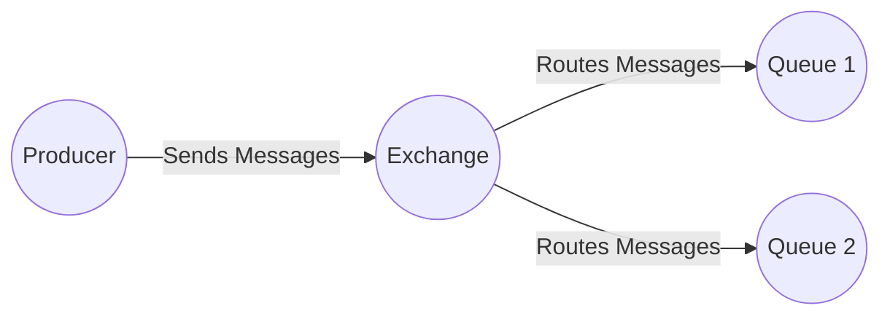
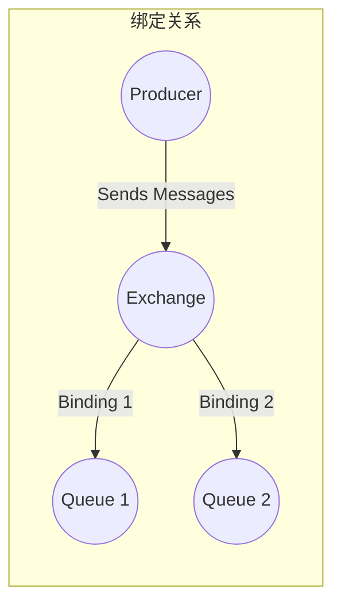
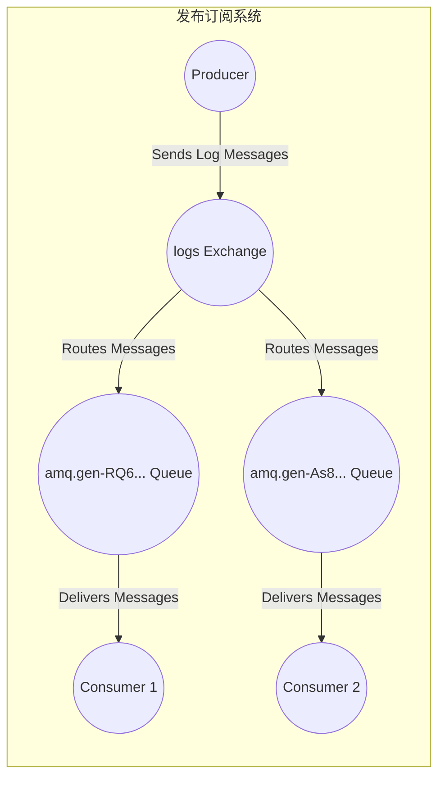

# RabbitMQ教程 - 发布/订阅
## 发布/订阅（使用Java客户端）

在上一个教程中，我们创建了一个工作队列。工作队列背后的假设是每个任务都只会被发送给一个工作进程。在本教程中，我们将做一些完全不同的事情——我们会将一条消息发送给多个消费者。这种模式被称为 “发布/订阅”。

为了说明这种模式，我们将构建一个简单的日志系统。它将由两个程序组成——第一个程序用于发送日志消息，第二个程序用于接收并打印这些消息。

在我们的日志系统中，每个正在运行的接收程序副本都会收到消息。这样，我们就可以运行一个接收程序将日志写入磁盘；同时，还能运行另一个接收程序在屏幕上查看日志。

本质上，发布的日志消息将被广播给所有的接收者。
## 交换器（Exchanges）
在之前的教程中，我们向队列发送消息以及从队列接收消息。现在是时候介绍RabbitMQ完整的消息传递模型了。

让我们快速回顾一下之前教程中涉及的内容：
- 生产者是发送消息的用户应用程序。
- 队列是存储消息的缓冲区。
- 消费者是接收消息的用户应用程序。

RabbitMQ消息传递模型的核心思想是，生产者从不直接将任何消息发送到队列。实际上，生产者通常甚至不知道消息是否会被发送到任何队列。

相反，生产者只能将消息发送到交换器。交换器是一个非常简单的组件。一方面，它从生产者接收消息；另一方面，它将消息推送到队列。交换器必须确切知道如何处理接收到的消息。是将其追加到特定队列？追加到多个队列？还是丢弃？这些规则由交换器类型定义。

有几种可用的交换器类型：`direct`（直连）、`topic`（主题）、`headers`（头）和`fanout`（扇出）。我们将重点关注最后一种——扇出交换器。让我们创建一个这种类型的交换器，并将其命名为`logs`：
```java
channel.exchangeDeclare("logs", "fanout");
```
扇出交换器非常简单。从它的名字你可能就能猜到，它只是将接收到的所有消息广播到它知道的所有队列。这正是我们的日志系统所需要的。
### 列出交换器
要列出服务器上的交换器，可以运行非常有用的`rabbitmqctl`命令：
```bash
sudo rabbitmqctl list_exchanges
```
在这个列表中，会有一些`amq.*`交换器和默认（未命名）交换器。这些是默认创建的，但目前你不太可能需要使用它们。
### 无名交换器
在之前的教程中，我们对交换器一无所知，但仍然能够向队列发送消息。这之所以可行，是因为我们使用了默认交换器，我们用空字符串（`""`）来标识它。

回想一下我们之前是如何发布消息的：
```java
channel.basicPublish("", "hello", null, message.getBytes());
```
第一个参数是交换器的名称。空字符串表示默认或无名交换器：消息会被路由到名称由`routingKey`指定的队列（如果该队列存在）。

现在，我们可以改为向我们命名的交换器发布消息：
```java
channel.basicPublish("logs", "", null, message.getBytes());
```
## 临时队列
你可能还记得，之前我们使用的队列都有特定的名称（还记得`hello`和`task_queue`吗？）。能够给队列命名对我们来说至关重要——我们需要让工作进程指向同一个队列。当你希望在生产者和消费者之间共享队列时，给队列命名很重要。

但对于我们的日志系统来说并非如此。我们希望接收所有的日志消息，而不仅仅是其中一部分。我们也只对当前正在流动的消息感兴趣，而不是旧消息。为了解决这个问题，我们需要做两件事。
- 首先，每当我们连接到RabbitMQ时，都需要一个全新的、空的队列。为此，我们可以创建一个随机命名的队列，或者更好的方法是——让服务器为我们选择一个随机的队列名称。
- 其次，一旦我们断开消费者的连接，该队列应该自动删除。

在Java客户端中，当我们调用`queueDeclare()`时不传入任何参数，就会创建一个非持久化、**排他的**、自动删除的队列，并生成一个队列名称：
```java
String queueName = channel.queueDeclare().getQueue();
```
你可以在队列指南中了解更多关于`exclusive`标志和其他队列属性的信息。

此时，`queueName`包含一个随机生成的队列名称。例如，它可能看起来像`amq.gen-JzTY20BRgKO-HjmUJj0wLg`。
## 绑定（Bindings）

我们已经创建了一个扇出交换器和一个队列。现在我们需要告诉交换器将消息发送到我们的队列。交换器和队列之间的这种关系被称为绑定。
```java
channel.queueBind(queueName, "logs", "");
```
从现在开始，`logs`交换器会将消息追加到我们的队列中。
### 列出绑定
你可以使用`rabbitmqctl list_bindings`列出现有的绑定，你猜对了，就是用这个命令。
## 整合

发送日志消息的生产者程序与上一个教程相比并没有太大不同。最重要的变化是，我们现在要将消息发布到`logs`交换器，而不是无名交换器。发送时我们需要提供一个`routingKey`，但对于扇出交换器，它的值会被忽略。以下是`EmitLog.java`程序的代码：
```java
public class EmitLog {
    private static final String EXCHANGE_NAME = "logs";

    public static void main(String[] argv) throws Exception {
        ConnectionFactory factory = new ConnectionFactory();
        factory.setHost("localhost");
        try (Connection connection = factory.newConnection();
             Channel channel = connection.createChannel()) {
            channel.exchangeDeclare(EXCHANGE_NAME, "fanout");
            String message = argv.length < 1? "info: Hello World!" :
                    String.join(" ", argv);
            channel.basicPublish(EXCHANGE_NAME, "", null, message.getBytes("UTF-8"));
            System.out.println(" [x] Sent '" + message + "'");
        }
    }
}
```
（`EmitLog.java`源代码）

如你所见，建立连接后我们声明了交换器。这一步是必要的，因为禁止向不存在的交换器发布消息。

如果还没有队列绑定到交换器，消息将会丢失，但这对我们来说没关系；如果还没有消费者在监听，我们可以安全地丢弃消息。

`ReceiveLogs.java`的代码如下：
```java
import com.rabbitmq.client.Channel;
import com.rabbitmq.client.Connection;
import com.rabbitmq.client.ConnectionFactory;
import com.rabbitmq.client.DeliverCallback;

public class ReceiveLogs {
    private static final String EXCHANGE_NAME = "logs";

    public static void main(String[] argv) throws Exception {
        ConnectionFactory factory = new ConnectionFactory();
        factory.setHost("localhost");
        Connection connection = factory.newConnection();
        Channel channel = connection.createChannel();
        channel.exchangeDeclare(EXCHANGE_NAME, "fanout");
        String queueName = channel.queueDeclare().getQueue();
        channel.queueBind(queueName, EXCHANGE_NAME, "");
        System.out.println(" [*] Waiting for messages. To exit press CTRL+C");
        DeliverCallback deliverCallback = (consumerTag, delivery) -> {
            String message = new String(delivery.getBody(), "UTF-8");
            System.out.println(" [x] Received '" + message + "'");
        };
        channel.basicConsume(queueName, true, deliverCallback, consumerTag -> { });
    }
}
```
（`ReceiveLogs.java`源代码）

像之前一样编译，我们就完成了。
```bash
javac -cp $CP EmitLog.java ReceiveLogs.java
```
如果你想将日志保存到文件中，只需打开一个控制台并输入：
```bash
java -cp $CP ReceiveLogs > logs_from_rabbit.log
```
如果你想在屏幕上查看日志，打开一个新的终端并运行：
```bash
java -cp $CP ReceiveLogs
```
当然，要发送日志，输入：
```bash
java -cp $CP EmitLog
```
使用`rabbitmqctl list_bindings`，你可以验证代码是否按照我们的预期实际创建了绑定和队列。运行两个`ReceiveLogs.java`程序时，你应该会看到类似这样的内容：
```bash
sudo rabbitmqctl list_bindings
# => Listing bindings ...
# => logs    exchange        amq.gen-JzTY20BRgKO-HjmUJj0wLg  queue           []
# => logs    exchange        amq.gen-vso0PVvyiRIL2WoV3i48Yg  queue           []
# => ...done.
```
对结果的解释很简单：来自`logs`交换器的数据被发送到两个由服务器分配名称的队列。这正是我们想要的。

要了解如何监听部分消息，请继续学习教程4。 