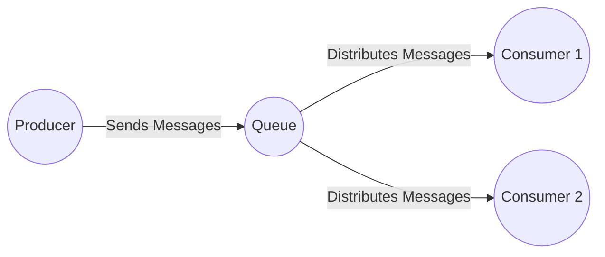
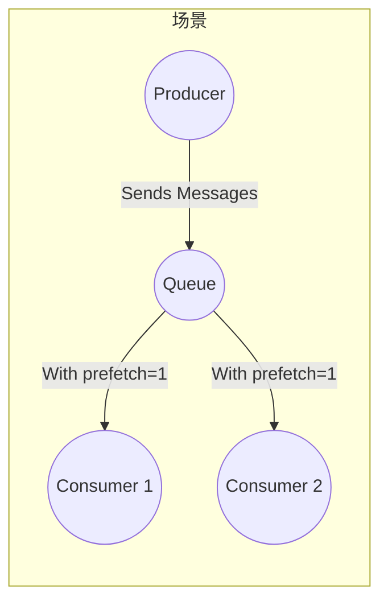

# RabbitMQ教程 - 工作队列
## 工作队列（使用Java客户端）


在第一个教程中，我们编写了从命名队列发送和接收消息的程序。在本教程中，我们将创建一个工作队列，用于在多个工作进程之间分配耗时任务。

工作队列（也称为任务队列）背后的主要思想是避免立即执行资源密集型任务并等待其完成。相反，我们安排任务稍后执行。我们将任务封装为消息并发送到队列中。在后台运行的工作进程将取出任务并最终执行作业。当你运行多个工作进程时，任务将在它们之间共享。

这个概念在Web应用程序中特别有用，因为在短暂的HTTP请求窗口内无法处理复杂任务。
## 准备工作
在上一教程中，我们发送了一条包含 “Hello World!” 的消息。现在，我们将发送代表复杂任务的字符串。我们没有实际的任务，比如调整图片大小或渲染PDF文件，所以我们通过使用`Thread.sleep()`函数假装忙碌来模拟。我们将字符串中的点的数量作为其复杂程度；每个点代表一秒的 “工作”。例如，由 “Hello...” 描述的模拟任务将花费三秒钟。

我们将对上一个示例中的`Send.java`代码进行轻微修改，以便从命令行发送任意消息。这个程序将任务安排到我们的工作队列中，所以我们将其命名为`NewTask.java`：
```java
String message = String.join(" ", argv);
channel.basicPublish("", "hello", null, message.getBytes());
System.out.println(" [x] Sent '" + message + "'");
```
我们旧的`Recv.java`程序也需要一些更改：它需要为消息体中的每个点模拟一秒的工作。它将处理传递的消息并执行任务，所以我们将其命名为`Worker.java`：
```java
DeliverCallback deliverCallback = (consumerTag, delivery) -> {
    String message = new String(delivery.getBody(), "UTF-8");
    System.out.println(" [x] Received '" + message + "'");
    try {
        doWork(message);
    } finally {
        System.out.println(" [x] Done");
    }
};
boolean autoAck = true; // 下面会介绍确认机制
channel.basicConsume(TASK_QUEUE_NAME, autoAck, deliverCallback, consumerTag -> { });
```
我们模拟执行时间的假任务：
```java
private static void doWork(String task) throws InterruptedException {
    for (char ch: task.toCharArray()) {
        if (ch == '.') Thread.sleep(1000);
    }
}
```
按照教程一的方式编译它们（工作目录中有jar文件且设置了环境变量`CP`）：
```bash
javac -cp $CP NewTask.java Worker.java
```
## 轮询分发
使用任务队列的优点之一是能够轻松实现工作并行化。如果我们积累了大量待处理工作，可以添加更多的工作进程，从而轻松实现扩展。

首先，让我们尝试同时运行两个工作进程实例。它们都将从队列中获取消息，但具体是如何获取的呢？让我们来看看。

你需要打开三个控制台。其中两个将运行工作进程程序。这些控制台将是我们的两个消费者——C1和C2。
```bash
# shell 1
java -cp $CP Worker
# => [*] Waiting for messages. To exit press CTRL+C
# shell 2
java -cp $CP Worker
# => [*] Waiting for messages. To exit press CTRL+C
```
在第三个控制台中，我们将发布新任务。启动消费者后，你可以发布一些消息：
```bash
# shell 3
java -cp $CP NewTask First message.
# => [x] Sent 'First message.'
java -cp $CP NewTask Second message..
# => [x] Sent 'Second message..'
java -cp $CP NewTask Third message...
# => [x] Sent 'Third message...'
java -cp $CP NewTask Fourth message....
# => [x] Sent 'Fourth message....'
java -cp $CP NewTask Fifth message.....
# => [x] Sent 'Fifth message.....'
```
让我们看看哪些消息被发送到了我们的工作进程：
```bash
java -cp $CP Worker
# => [*] Waiting for messages. To exit press CTRL+C
# => [x] Received 'First message.'
# => [x] Received 'Third message...'
# => [x] Received 'Fifth message.....'
java -cp $CP Worker
# => [*] Waiting for messages. To exit press CTRL+C
# => [x] Received 'Second message..'
# => [x] Received 'Fourth message....'
```
默认情况下，RabbitMQ会按顺序将每条消息发送给下一个消费者。平均而言，每个消费者会收到相同数量的消息。这种分发消息的方式称为轮询。可以尝试使用三个或更多的工作进程来测试。
## 消息确认
执行一个任务可能需要几秒钟，你可能想知道如果一个消费者开始执行一个长时间的任务，但在完成之前就终止了会发生什么。按照我们目前的代码，一旦RabbitMQ将消息发送给消费者，它会立即将该消息标记为删除。在这种情况下，如果你终止一个工作进程，它刚刚正在处理的消息就会丢失。已发送到这个特定工作进程但尚未处理的消息也会丢失。

但我们不希望丢失任何任务。如果一个工作进程挂掉了，我们希望该任务能被发送给另一个工作进程。

为了确保消息永远不会丢失，RabbitMQ支持消息确认机制。消费者会发回一个确认消息，告诉RabbitMQ某条特定的消息已被接收、处理，RabbitMQ可以自由删除它。

如果一个消费者在没有发送确认消息的情况下挂掉（其通道关闭、连接关闭或TCP连接丢失），RabbitMQ会认为该消息没有被完全处理，并将其重新放入队列。如果此时有其他消费者在线，它会迅速将该消息重新发送给另一个消费者。这样一来，即使工作进程偶尔挂掉，你也可以确保没有消息会丢失。

消费者投递确认设置了超时时间（默认30分钟）。这有助于检测那些从不确认投递的有问题（卡住）的消费者。你可以按照“投递确认超时”中的描述增加这个超时时间。

手动消息确认默认是开启的。在之前的示例中，我们通过`autoAck=true`标志显式地关闭了它。现在是时候将这个标志设置为`false`，并在工作进程完成一个任务后发送一个适当的确认消息。
```java
channel.basicQos(1); // 一次只接受一个未确认的消息（见下文）
DeliverCallback deliverCallback = (consumerTag, delivery) -> {
    String message = new String(delivery.getBody(), "UTF-8");
    System.out.println(" [x] Received '" + message + "'");
    try {
        doWork(message);
    } finally {
        System.out.println(" [x] Done");
        channel.basicAck(delivery.getEnvelope().getDeliveryTag(), false);
    }
};
boolean autoAck = false;
channel.basicConsume(TASK_QUEUE_NAME, autoAck, deliverCallback, consumerTag -> { });
```
使用这段代码，你可以确保即使在工作进程处理消息时使用`CTRL+C`终止它，也不会丢失任何内容。在工作进程终止后不久，所有未确认的消息都会被重新发送。

确认消息必须在接收投递的同一通道上发送。尝试在不同的通道上进行确认会导致通道级别的协议异常。有关更多信息，请参阅确认机制的文档指南。
### 遗漏确认消息
遗漏`basicAck`是一个常见的错误。这是一个很容易犯的错误，但后果很严重。当你的客户端退出时，消息会被重新发送（这可能看起来像是随机重新发送），但RabbitMQ会占用越来越多的内存，因为它无法释放任何未确认的消息。

为了调试这类错误，你可以使用`rabbitmqctl`打印`messages_unacknowledged`字段：
```bash
sudo rabbitmqctl list_queues name messages_ready messages_unacknowledged
```
在Windows上，去掉`sudo`：
```bash
rabbitmqctl.bat list_queues name messages_ready messages_unacknowledged
```
## 消息持久化
我们已经学习了如何确保即使消费者挂掉，任务也不会丢失。但是如果RabbitMQ服务器停止，我们的任务仍然会丢失。

除非你告知RabbitMQ不要这样做，否则当它退出或崩溃时，它会忘记队列和消息。为确保消息不丢失，需要做两件事：我们需要将队列和消息都标记为持久化。

首先，我们需要确保队列在RabbitMQ节点重启后仍然存在。为此，我们需要将其声明为持久化队列：
```java
boolean durable = true;
channel.queueDeclare("hello", durable, false, false, null);
```
虽然这个命令本身是正确的，但在我们目前的设置中它不起作用。这是因为我们已经定义了一个名为`hello`的非持久化队列。**RabbitMQ不允许你用不同的参数重新定义一个已存在的队列，并且会向任何尝试这样做的程序返回一个错误**。不过有一个快速的解决方法——让我们声明一个不同名称的队列，例如`task_queue`：
```java
boolean durable = true;
channel.queueDeclare("task_queue", durable, false, false, null);
```
这个`queueDeclare`的更改需要同时应用到生产者和消费者的代码中。

此时，我们可以确保即使RabbitMQ重启，`task_queue`队列也不会丢失。现在我们需要通过将`MessageProperties`（它实现了`BasicProperties`）设置为`PERSISTENT_TEXT_PLAIN`值来将我们的消息标记为持久化。
```java
import com.rabbitmq.client.MessageProperties;
channel.basicPublish("", "task_queue",
        MessageProperties.PERSISTENT_TEXT_PLAIN,
        message.getBytes());
```
### 关于消息持久化的注意事项
将消息标记为持久化并不能完全保证消息不会丢失。虽然它告诉RabbitMQ将消息保存到磁盘，但在RabbitMQ接受消息但尚未保存的这一小段时间窗口内，仍存在丢失消息的可能性。此外，RabbitMQ不会对每条消息都执行`fsync(2)`操作——消息可能只是被保存到缓存中，而没有真正写入磁盘。这种持久化保证并不强，但对于我们的简单任务队列来说已经足够了。如果你需要更强的保证，可以使用发布者确认机制。
## 公平分发
你可能已经注意到，消息分发仍然不完全符合我们的预期。例如，在有两个工作进程的情况下，当所有奇数编号的消息处理时间长，偶数编号的消息处理时间短时，一个工作进程会一直忙碌，而另一个工作进程几乎没什么工作可做。然而，RabbitMQ对此一无所知，仍然会平均分配消息。

出现这种情况是因为RabbitMQ只是在消息进入队列时进行分发。它不会查看消费者未确认消息的数量。它只是盲目地将第n条消息分发给第n个消费者。

为了解决这个问题，我们可以使用`basicQos`方法并将`prefetchCount`设置为`1`。这会告诉RabbitMQ一次不要给一个工作进程发送多于一条消息。换句话说，在一个工作进程处理并确认前一条消息之前，不要给它分发新的消息。相反，它会将消息分发给下一个不忙的工作进程。
```java
int prefetchCount = 1;
channel.basicQos(prefetchCount);
```
### 关于队列大小的注意事项
如果所有的工作进程都处于忙碌状态，你的队列可能会填满。你需要留意这一点，也许可以添加更多的工作进程，或者采用其他策略。
## 整合
我们`NewTask.java`类的最终代码：
```java
import com.rabbitmq.client.Channel;
import com.rabbitmq.client.Connection;
import com.rabbitmq.client.ConnectionFactory;
import com.rabbitmq.client.MessageProperties;

public class NewTask {
    private static final String TASK_QUEUE_NAME = "task_queue";

    public static void main(String[] argv) throws Exception {
        ConnectionFactory factory = new ConnectionFactory();
        factory.setHost("localhost");
        try (Connection connection = factory.newConnection();
             Channel channel = connection.createChannel()) {
            channel.queueDeclare(TASK_QUEUE_NAME, true, false, false, null);
            String message = String.join(" ", argv);
            channel.basicPublish("", TASK_QUEUE_NAME,
                    MessageProperties.PERSISTENT_TEXT_PLAIN,
                    message.getBytes("UTF-8"));
            System.out.println(" [x] Sent '" + message + "'");
        }
    }
}
```
（`NewTask.java`源代码）

以及我们的`Worker.java`代码：
```java
import com.rabbitmq.client.Channel;
import com.rabbitmq.client.Connection;
import com.rabbitmq.client.ConnectionFactory;
import com.rabbitmq.client.DeliverCallback;

public class Worker {
    private static final String TASK_QUEUE_NAME = "task_queue";

    public static void main(String[] argv) throws Exception {
        ConnectionFactory factory = new ConnectionFactory();
        factory.setHost("localhost");
        final Connection connection = factory.newConnection();
        final Channel channel = connection.createChannel();
        channel.queueDeclare(TASK_QUEUE_NAME, true, false, false, null);
        System.out.println(" [*] Waiting for messages. To exit press CTRL+C");
        channel.basicQos(1);
        DeliverCallback deliverCallback = (consumerTag, delivery) -> {
            String message = new String(delivery.getBody(), "UTF-8");
            System.out.println(" [x] Received '" + message + "'");
            try {
                doWork(message);
            } finally {
                System.out.println(" [x] Done");
                channel.basicAck(delivery.getEnvelope().getDeliveryTag(), false);
            }
        };
        channel.basicConsume(TASK_QUEUE_NAME, false, deliverCallback, consumerTag -> { });
    }

    private static void doWork(String task) {
        for (char ch : task.toCharArray()) {
            if (ch == '.') {
                try {
                    Thread.sleep(1000);
                } catch (InterruptedException _ignored) {
                    Thread.currentThread().interrupt();
                }
            }
        }
    }
}
```
（`Worker.java`源代码）

通过使用消息确认机制和`prefetchCount`，你可以设置一个工作队列。持久化选项可以让任务在RabbitMQ重启后仍然存在。

现在我们可以进入教程3，学习如何将同一条消息发送给多个消费者。 